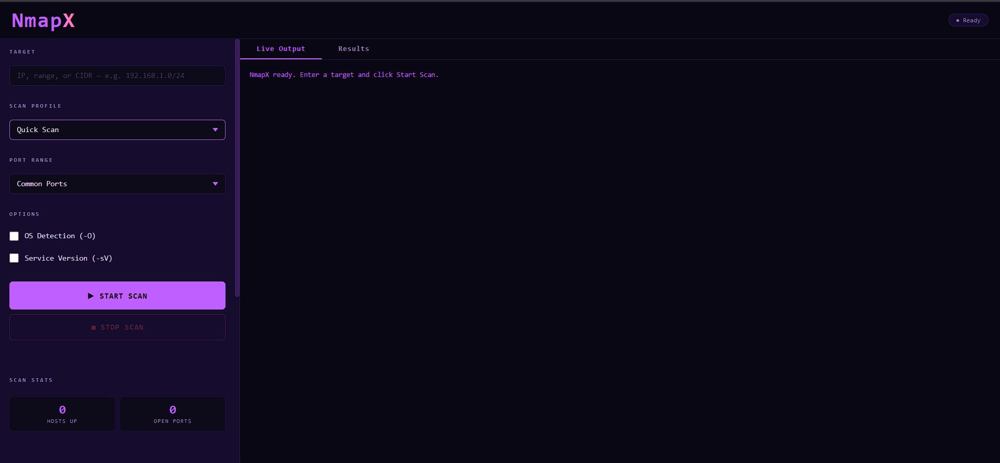
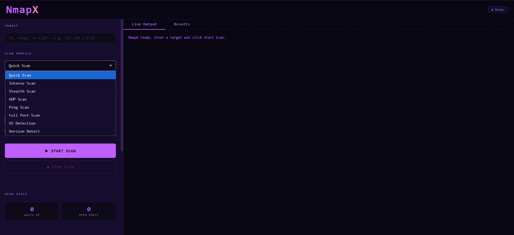
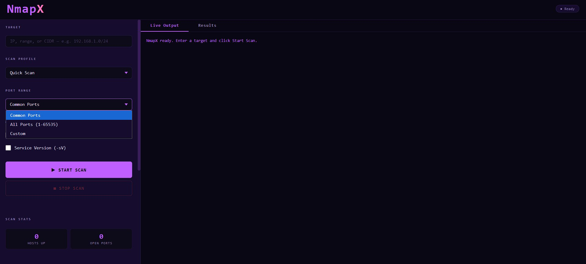
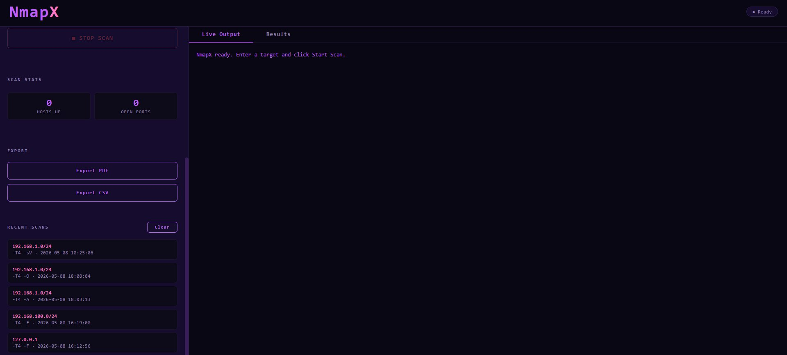

<div align="center">


# NmapX — Network Scanner

### A modern, Synthwave-themed GUI for Nmap on Windows

[](https://www.python.org/)
[](https://flask.palletsprojects.com/)
[](https://nmap.org/)
[](https://www.microsoft.com/windows)
[](LICENSE)
[](https://www.eccouncil.org/)

> Stop memorizing Nmap flags. NmapX gives you the full power of Nmap through a clean,
> modern browser interface — with real-time output, structured results, scan history,
> and one-click PDF/CSV exports.

**Built as a Certified Ethical Hacking (CEH) final project.**

</div>

---

## Screenshots

<table>
  <tr>
    <td align="center">
      
      <br/><sub><b>Main Interface — Ready State</b></sub>
    </td>
    <td align="center">
      
      <br/><sub><b>8 Built-in Scan Profiles</b></sub>
    </td>
  </tr>
  <tr>
    <td align="center">
      
      <br/><sub><b>Flexible Port Range Selection</b></sub>
    </td>
    <td align="center">
      
      <br/><sub><b>Scan History and Export Panel</b></sub>
    </td>
  </tr>
</table>

---

## What is NmapX?

[Nmap](https://nmap.org) is the industry standard for network reconnaissance — but its
command-line interface has a steep learning curve. Existing GUIs like **Zenmap are
discontinued** and show their age.

**NmapX** solves this by wrapping Nmap in a modern web-based interface served locally
via Flask. You get:

- All the power of Nmap, zero flag memorization
- Live scan output streamed to your browser as it happens
- Results parsed into a clean, color-coded table
- Every scan saved to a local SQLite database
- One-click PDF and CSV report export
- A Synthwave purple dark theme that actually looks good on LinkedIn

---

## Features

### Scan Profiles

8 ready-to-use profiles covering every common use case:

| Profile | Nmap Arguments | Use Case |
|---|---|---|
| **Quick Scan** | `-T4 -F` | Fast top-100 port sweep |
| **Intense Scan** | `-T4 -A` | Full recon — OS + version + scripts |
| **Stealth Scan** | `-sS -T2` | Half-open SYN scan, low noise |
| **UDP Scan** | `-sU -T4` | UDP port discovery |
| **Ping Scan** | `-sn` | Host discovery only, no ports |
| **Full Port Scan** | `-T4 -p-` | All 65535 TCP ports |
| **OS Detection** | `-T4 -O` | Operating system fingerprinting |
| **Version Detect** | `-T4 -sV` | Service and version banner grabbing |

### Core Capabilities

| Feature | Details |
|---|---|
| **Target Input** | Single IP · IP range · CIDR notation |
| **Port Range** | Common Ports (`--top-ports 1000`) · All Ports (`1-65535`) · Custom |
| **Live Terminal** | Real-time Nmap output streamed every 2 seconds |
| **Results Table** | Host · Port · Protocol · State · Service · Version |
| **Color Coding** | 🟢 Open · 🟡 Filtered · 🔴 Closed |
| **OS Detection** | Toggle `-O` flag independently |
| **Service Version** | Toggle `-sV` flag independently |
| **Stop Scan** | Terminate any running scan instantly |
| **Scan History** | Last 5 scans in sidebar · full SQLite persistence |
| **Export PDF** | Server-generated PDF report via ReportLab |
| **Export CSV** | Browser-generated CSV — no server round-trip |
| **Non-blocking UI** | Scans run in background threads — UI never freezes |

---

## Prerequisites

Before running NmapX, make sure the following are set up on your Windows machine:

### 1. Python 3.10 or newer
```
https://www.python.org/downloads/
```
> The codebase uses Python 3.10+ syntax. Earlier versions will not work.

### 2. Nmap for Windows
```
https://nmap.org/download.html
```
> ⚠️ **Critical:** During installation, check **"Add Nmap to PATH"**.
> NmapX verifies `nmap` is reachable in PATH on every scan start and will
> return an error if it is not found.

### 3. Administrator Privileges *(for certain scan types)*
> Stealth Scan (`-sS`) and OS Detection (`-O`) require raw socket access,
> which needs the terminal to be run as Administrator. Quick Scan, Ping Scan,
> and Version Detect work without elevation.

---

## Installation

### 1 — Clone the repository
```bash
git clone https://github.com/your-username/NmapX.git
cd NmapX
```

### 2 — Create and activate a virtual environment
```bash
python -m venv venv
venv\Scripts\activate
```

### 3 — Install Python dependencies
```bash
pip install -r requirements.txt
```

### 4 — Run the application
```bash
python app.py
```

### 5 — Open in your browser
```
http://127.0.0.1:5000
```

> Flask runs on **port 5000** (hardcoded). Make sure no other service occupies that port.

---

## Dependencies

```txt
Flask>=3.0.0
python-nmap>=0.7.1
reportlab>=4.0.0
```

**Standard library modules used heavily:**
`threading` · `subprocess` · `sqlite3` · `tempfile` · `uuid` · `io` · `csv` · `pathlib` · `datetime` · `ctypes`

---

## Project Structure

```
NmapX/
├── app.py              ← Flask app — API routes and scan lifecycle
├── scanner.py          ← Nmap execution, output streaming, XML parsing
├── database.py         ← SQLite history (insert, list, clear)
├── exporter.py         ← PDF report generation via ReportLab
├── requirements.txt    ← Python package dependencies
├── nmapx_history.db    ← Auto-created SQLite database (gitignored)
└── templates/
    └── index.html      ← Complete frontend (HTML + CSS + JS)
```

---

## API Reference

| Method | Endpoint | Description |
|---|---|---|
| `GET` | `/` | Serve the frontend UI |
| `POST` | `/api/scan/start` | Start a new background scan |
| `GET` | `/api/scan/status/<id>` | Poll live output and status |
| `POST` | `/api/scan/stop/<id>` | Stop an active scan |
| `POST` | `/api/export/pdf` | Download results as PDF |
| `GET` | `/api/history` | Fetch recent scan history |
| `POST` | `/api/history/clear` | Delete all history records |

<details>
<summary><b>Request / Response examples</b></summary>

**POST `/api/scan/start`**
```json
{
  "target":      "192.168.1.0/24",
  "profile":     "-T4 -F",
  "ports":       "--top-ports 1000",
  "os_detect":   false,
  "svc_version": false
}
```

**GET `/api/scan/status/<id>`**
```json
{
  "status":     "running | done | error | stopped",
  "output":     ["[10:42:01]  Starting Nmap...", "..."],
  "results":    [{ "host": "192.168.1.1", "port": 80, "protocol": "tcp", "state": "open", "service": "http", "version": "nginx 1.18" }],
  "hosts_up":   3,
  "open_ports": 12,
  "error":      ""
}
```
</details>

---

## How It Works

```
Browser UI  ──POST /api/scan/start──►  Flask (app.py)
                                              │
                                     Spawns daemon thread
                                              │
                                       scanner.py runs:
                                       nmap [args] [target]
                                              │
                                    Streams stdout line by line
                                    Writes XML to tempfile
                                    Parses XML → result rows
                                              │
Browser  ◄──polls /api/scan/status every 2s──►│
    │
    ├─► Terminal textarea: lines appended live
    ├─► On done: Results table populated
    ├─► Stats updated: Hosts Up / Open Ports
    └─► Scan record saved to SQLite
```

---

## Known Limitations

| Item | Detail |
|---|---|
| Admin required for some scans | Stealth + OS Detection need elevated terminal |
| Port hardcoded | Flask uses port `5000` — edit `app.py` to change |
| Scan timeout | Dynamic per profile — min 3600s, max 21600s |
| History sidebar | Displays last 5 scans only |
| No `.exe` packaging | No PyInstaller config yet — must run via Python |
| Memory not flushed | Completed scan state stays in RAM until app restart |

---

## Comparison with Zenmap

| Feature | Zenmap | NmapX |
|---|---|---|
| Actively maintained | ❌ | ✅ |
| Modern UI | ❌ | ✅ |
| Dark theme | ❌ | ✅ Synthwave Purple |
| Live output streaming | ⚠️ Partial | ✅ |
| Persistent scan history | ⚠️ Basic | ✅ SQLite-backed |
| PDF export | ❌ | ✅ |
| CSV export | ❌ | ✅ |
| Web-based interface | ❌ | ✅ |
| Windows 10/11 support | ⚠️ Partial | ✅ Full |

---

## Roadmap

- [ ] PyInstaller `.exe` packaging for standalone distribution
- [ ] NSE script selector with safety controls
- [ ] Network topology visualization (node graph)
- [ ] Scheduled / recurring scans with notifications
- [ ] CVE mapping via NVD API for discovered services
- [ ] Full scan history viewer (not limited to last 5)
- [ ] Theme switcher (dark / light)
- [ ] Multi-target scan queue

---

## Disclaimer

> ⚠️ **NmapX is developed strictly for educational purposes and authorized network
> testing only.**
> Never run scans on networks or systems you do not own or have explicit written
> permission to test. The developer is not responsible for any misuse of this tool.
> Unauthorized port scanning may be illegal in your jurisdiction.

---

## License

This project is licensed under the **MIT License** — see the [LICENSE](LICENSE) file
for details.

---

## Author

**Muhammad Ahmed**
CEH Student · Network Security Enthusiast

[](https://github.com/your-username)
[](https://linkedin.com/in/your-profile)

---

<div align="center">

Built with Python · Flask · Nmap · Synthwave energy

*Found this useful? Give it a ⭐ — it helps others find the project.*

</div>
